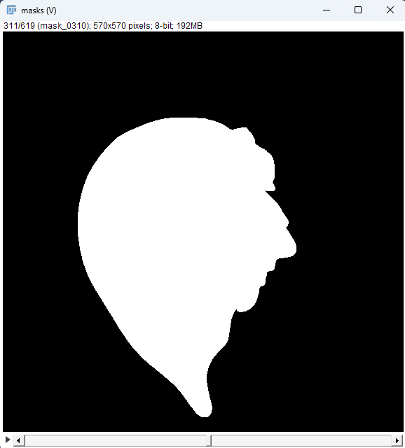

# organ-masker

`organ-masker` is a simple command-line tool to segment background from organ image stacks using the Segment Anything Model 2 (SAM2). Given a folder of 2D TIFF or JP2 slices, it:

1. Applies median filtering and intensity normalization.  
2. Builds forward/backward videos for SAM2 propagation.  
3. Runs SAM2 to generate a binary mask for each slice.  
4. Saves masks under an output directory (`masks/mask_0000.png`, etc.).

> **GPU Required:** SAM2 needs a CUDA-enabled NVIDIA GPU (CUDA ≥ 11.1).  

---

## Installation

1. **Clone and enter the repo**  
   ```bash
   git clone https://github.com/JosephBrunet/organ-masker.git
   cd organ-masker
   ```

2. **Create a Python 3.11+ virtual environment**
   
   Note: you can also use [uv](astral.sh/uv).

   Note: you will need to install the Tkinter package with apt (e.g. `sudo apt install python3-tk`) prior to creating the virtual env; if you have already created it, you need to delete it and recreate.
   
   ```bash
   python3 -m venv venv
   source venv/bin/activate
   ```
   

3. **Install dependencies**  
   ```bash
   pip install --upgrade pip
   pip install .
   ```

4. **Download SAM2 checkpoints**  
   The model weights are not stored in this repository (too large). Do the following:

   - **Linux** (example for “hiera-large”):  
     ```bash
     cd checkpoints
     ./download_ckpts.sh
     ```
 
   Ensure the downloaded file lives at:
   ```
   organ-masker/
   ├── checkpoints/
   │   └── sam2.1_hiera_large.pt
   │   └── ...
   ```

---


## Usage

```bash
organ-masker /path/to/image_folder --output /path/to/results
```

- **`/path/to/image_folder`**  
  Folder containing `.tif` or `.jp2` slices (sorted alphanumerically).

- **`--output /path/to/results`** _(optional)_  
  Base directory for outputs. Inside you’ll find:
  ```
  /path/to/results/segmentation_SAM2/
      ├── video_forward.mp4
      ├── video_backward.mp4
      └── masks/
          ├── mask_0000.png
          ├── mask_0001.png
          └── …
  ```

A window showing the middle slice will open. Click and drag the blue rectangle to create a rectangle covering the organ:

<p align="center">
  
</p>

The script will then convert to video and segment the whole volume.

<p align="center">
  
</p>

---

## License

This project is licensed under the MIT License. See [LICENSE](LICENSE) for details.
